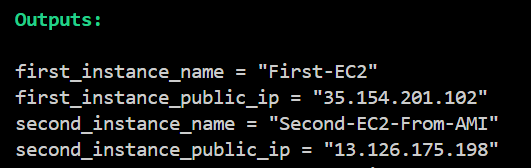

<h1><b>Launch EC2 Instances Using Terraform<b></h1> 

This project demonstrates how to launch AWS EC2 instances using Terraform.
It creates a security group, launches a first EC2 instance, creates an AMI from it, and then launches a second EC2 instance from that AMI. The setup follows Infrastructure as Code (IaC) best practices. 

🛠️ Technologies Used 
Terraform 
AWS EC2 
AWS Security Groups 
Amazon Machine Image (AMI)⚙️ Terraform Components 
Provider: AWS 
Resources: 
Security Group (SSH & HTTP access) 
First EC2 Instance 
AMI created from first EC2 
Second EC2 Instance launched from AMI 

Output 
First EC2 Public IP 
Second EC2 Public IP 
Instance Name Tags 
AMI created successfully 
